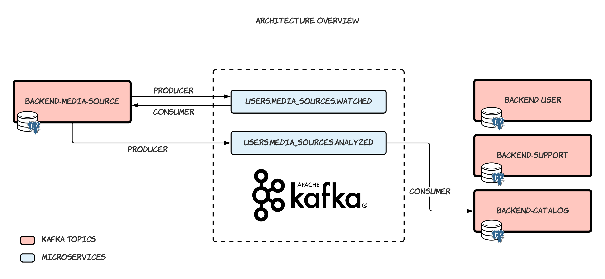

<p align="center">
  
</p>

<h3 align="center">
  Microservices architecture studies project using <a href="https://kafka.apache.org/">Apache Kafka®</a> 🚀
</h3>

## Table of Contents

- [Pre-requisites](#pre-requisites)
- [Getting started](#getting-started)
  - [Setting the environment variables](#setting-the-environment-variables)
  - [Importing postman collections (optional)](#importing-postman-collections-optional)
- [Up and Running!](#up-and-running)
- [Architecture Overview](#architecture-overview)

## Pre-requisites

- [Docker](https://www.docker.com/): 19.03.13 or higher.
- [docker-compose](https://docs.docker.com/compose/install/): 1.27.4 or higher.

## Getting started

### Setting the environment variables

Let's start by creating a new `.env` file. To do this, simply execute the command below:

```bash
$ cp .env.example .env
```

> You can also copy the contents of the `.env.example` file and paste it into an `.env` file at the root of the project directory.

### Importing postman collections (optional)

In the contents of this repository there is a collection of postman that can be imported to carry out HTTP requests.

It is located at: [docs/fiap-netflix.postman_collection.json](docs/fiap-netflix.postman_collection.json)

## Up and Running!

After installing all the requirements and (creating the `.env.` file), run the follow script:

```bash
./run.sh
```

> It is possible to pass the `--build` flag to rebuild the `docker-compose` services (e.g.: `./run.sh --build`)

## Architecture Overview

Below is a simple mapping of which, where and how microservices integrate!

<p align="center">
  
</p>

Then a sequence diagram that explains the flow of how a watched video is reflected in the catalog through communication between microservices:

<p align="center">
  
</p>
